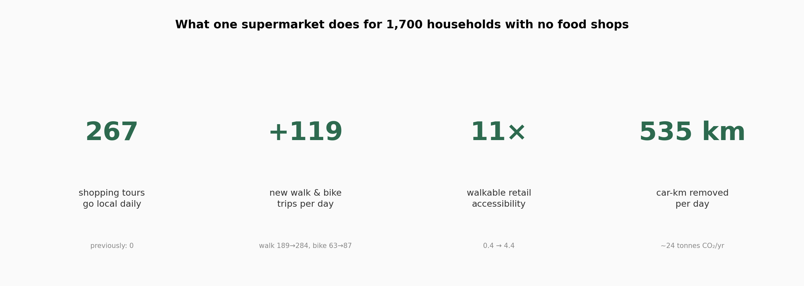
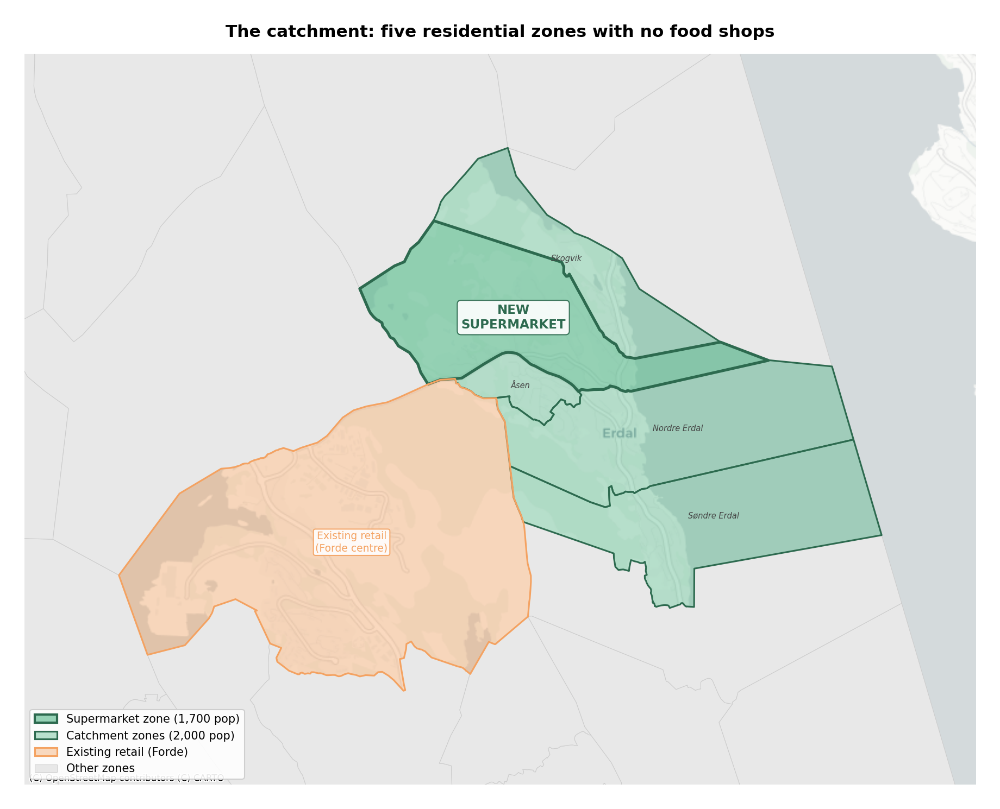
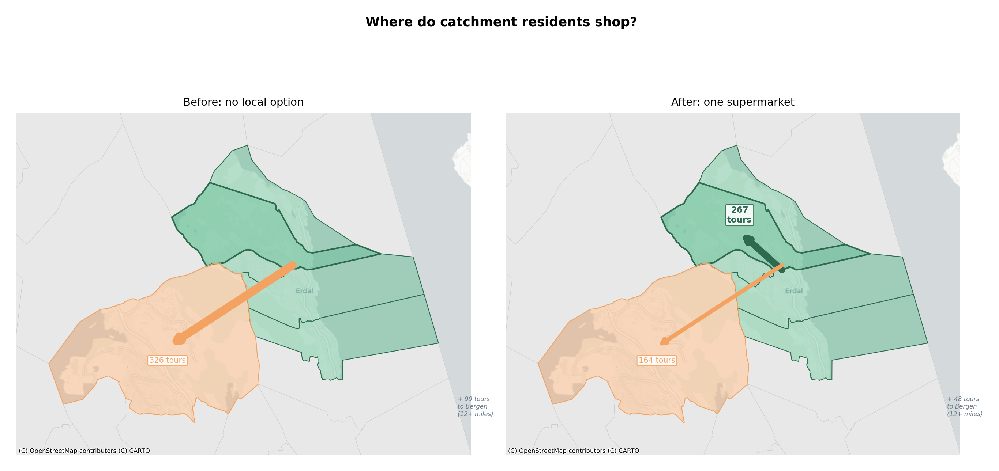
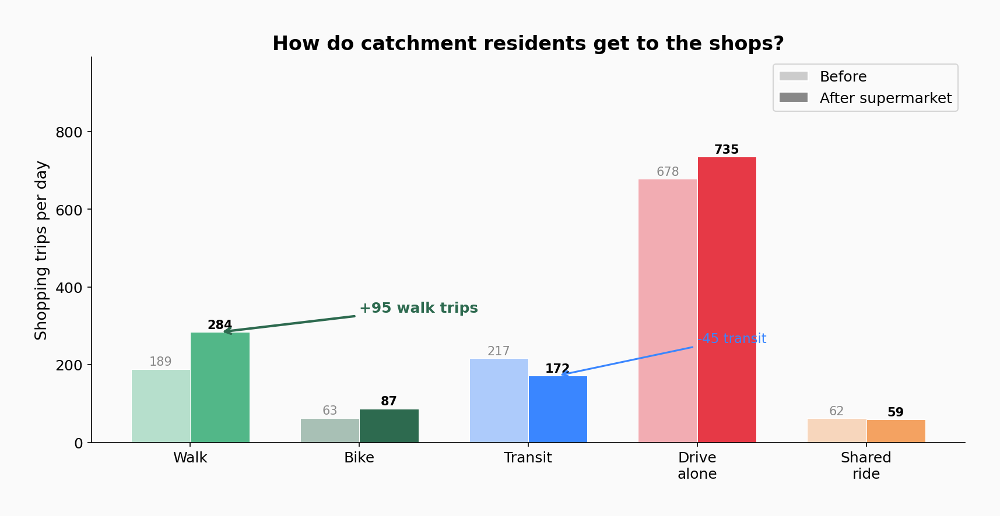
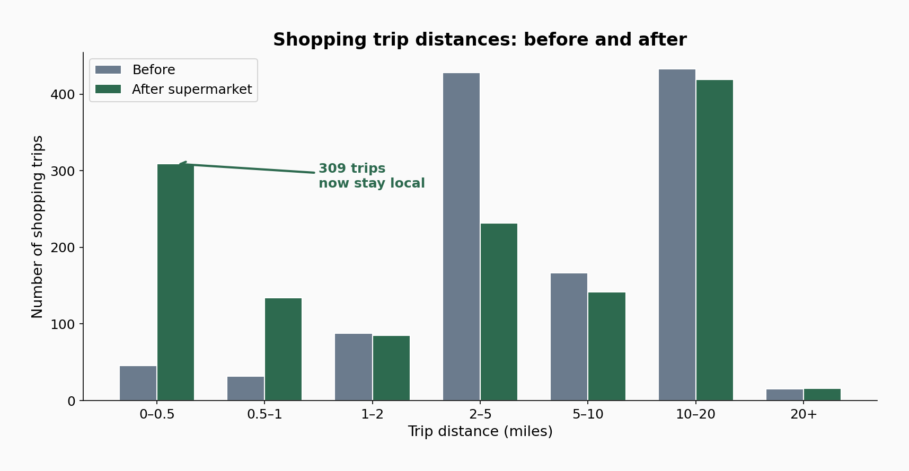
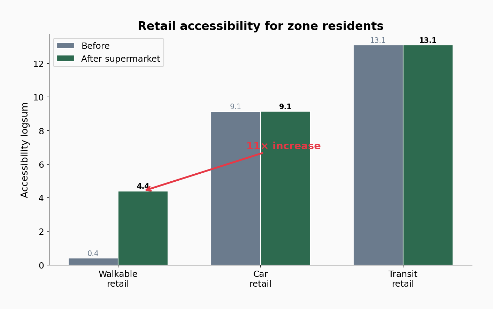
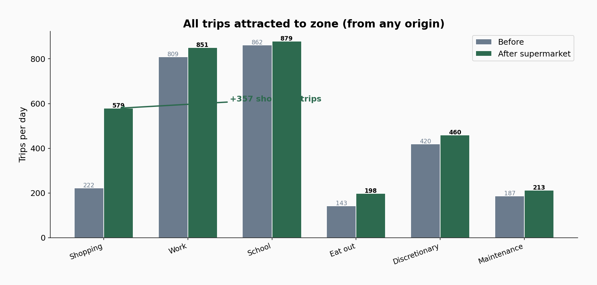

*Using an activity-based transport model to measure the impact of one supermarket in a Norwegian residential area with no food shops.*

<!-- truncate -->

## The problem

Cities like Bergen plan their retail around cars and city centres. Shops are concentrated in commercial zones, and residential neighbourhoods are left with nothing. When people inevitably drive to buy groceries, policymakers reach for expensive demand-management tools: toll roads, new bus lines, congestion charges.

But these are all demand-side fixes for what is fundamentally a supply-side problem. If the nearest supermarket is miles away, people will drive. No toll will change that. No bus subsidy will make a 45-minute transit trip competitive with a 20-minute drive for a bag of groceries.

The alternative is cheap and obvious: let shops exist where people already live.

## The experiment

To test this, I ran an activity-based travel demand model ([ActivitySim](https://activitysim.github.io/)) for the Vestland region of western Norway. The model covers 297,400 households and 648,676 people across 1,623 zones in Vestland county, using real synthetic population data and travel behaviour calibrated against the Norwegian national travel survey (RVU).

I picked a residential catchment in Sunnfjord municipality: five adjacent census zones (grunnkrets) centred on Stenrusten-Vardane. Together they contain roughly 1,700 households and 3,700 people. The area has essentially zero food retail — no supermarket, no convenience store, nothing. The nearest significant shopping is in Forde town centre, about 2 miles away.

The scenario is simple: add one medium-sized supermarket (think Rema 1000 or Kiwi scale, about 60 employees) to the centre of this neighbourhood. Nothing else changes — no new roads, no new bus stops, no infrastructure investment. Just a planning permission.

Then I ran the model twice — once without the supermarket, once with — and compared every shopping trip, mode choice, and destination decision for every resident in the catchment.

## The results

### People shop locally when they can

The most striking result is where people choose to shop. In the baseline, zero shopping tours from the catchment went to what is now the supermarket zone — there was nothing to go to. In the scenario, **267 shopping tours per day** go to the new supermarket. That's over half of all shopping tours from the catchment.

The other destinations collapse. Tours to Forde and other Sunnfjord zones drop from 326 to 164. Bergen drops from 99 to 48. People didn't stop shopping — they just stopped driving past their own neighbourhood to do it.

### More walking, less transit dependency

Across the catchment, walking trips for shopping jumped from 189 to 284 per day — a 50% increase. Cycling rose from 63 to 87. Meanwhile, transit dropped from 217 to 172. People who were taking the bus to Forde to shop now walk to the local supermarket instead.

### Trip distances fall

The distance distribution tells the story clearly. Before the supermarket, almost no shopping trips were under half a mile — there was nowhere to go. Afterwards, 309 trips per day are in the 0-0.5 mile band. The 2-5 mile band (trips to Forde) drops sharply.

Average shopping trip distance for catchment residents fell from 7.0 to 5.8 miles — a 17% reduction from a single planning decision. Total car-kilometres driven for shopping fell by 535 km per day, equivalent to roughly 24 tonnes of CO2 per year.

### Walkable accessibility transforms overnight

The clearest single statistic is walkable retail accessibility. This is a composite measure of how much retail a resident can reach on foot, weighted by travel time. For residents of the supermarket zone, it went from 0.4 to 4.4 — an **eleven-fold increase**.

Car-based retail accessibility barely moved (9.1 to 9.1). Transit retail accessibility didn't change at all. This confirms that the supermarket's impact is entirely local and entirely about walkability. It doesn't shift the regional retail picture. It transforms daily life for the people who live there.

### The zone becomes a destination

The supermarket doesn't just serve the immediate catchment. It attracts trips from further afield too. Shopping trips to the zone jumped from 222 to 579 per day — people from neighbouring areas also choose the new, closer option.

## What this costs

Here is the comparison that matters:

**To reduce car travel by demand management**, a municipality might:
- Build a new bus route: 5-15 million NOK/year in operating subsidy, serving perhaps a few hundred passengers daily
- Introduce a toll ring: political capital, enforcement infrastructure, and the toll hits hardest the people who have no alternative
- Subsidise cycling infrastructure: valuable in general, but doesn't help when the destination is miles away

**To achieve the same through supply:**
- Allow a supermarket to be built in a residential zone. A planning permission. Cost to the municipality: nothing. Cost to the developer: a normal commercial investment that generates its own revenue.

The supermarket removes 535 car-km per day, generates 119 new walk and bike trips, and transforms retail accessibility for thousands of residents. The only "investment" is a line on a zoning map.

## Caveats

This is a model, not a measurement. The numbers are estimates from a simulation calibrated to Norwegian travel survey data, not observed before-and-after counts. Some limitations worth noting:

**Intra-zone distances are zero** in the network data. The model cannot properly represent the advantage of walking 500 metres to a supermarket versus driving 2 km — both register as the same census zone with zero distance. This means walking trips are likely underpredicted, and the mode shift toward walking would be larger in reality.

**Shopping trip generation is about 25% below the RVU** (15% of modelled trips vs 20% in the travel survey). The absolute numbers would be higher with a fully calibrated tour frequency model.

**The travel survey itself underestimates short walk trips**, because grunnkrets zones are too large to reliably capture trips that start and end within the same zone. The data that feeds the model has a blind spot for exactly the kind of trip a local supermarket generates.

All of these biases point in the same direction: the real impact would likely be **larger** than what the model shows. These numbers are conservative.

## The argument

Norwegian zoning forces people into car dependency — not because they prefer to drive, but because the destinations are too far to reach any other way. Policymakers then spend millions trying to nudge people out of cars they were forced into.

This simulation shows that even a single, modest supply-side change — one supermarket in one residential neighbourhood — produces measurable shifts in travel behaviour. People shop locally. They walk more. They drive shorter distances. They stop taking the bus to distant town centres for groceries.

None of this required widening a road or building a bus stop. It required allowing a shop to exist where people live.

---

*Built with [ActivitySim](https://activitysim.github.io/), an open-source activity-based travel demand model. Synthetic population from SSB (Statistics Norway). Network data from OpenStreetMap via [AequilibraE](https://www.aequilibrae.com/).*
