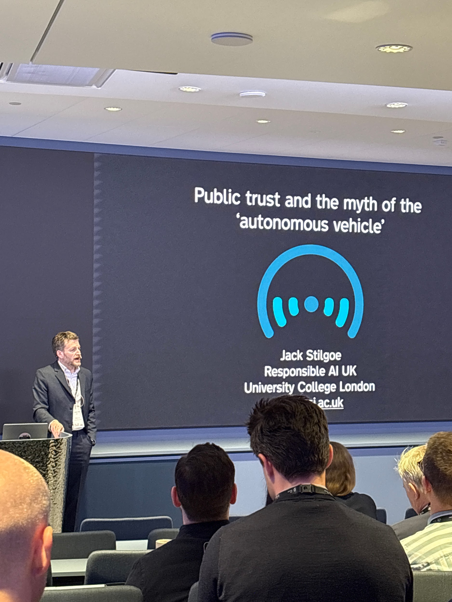
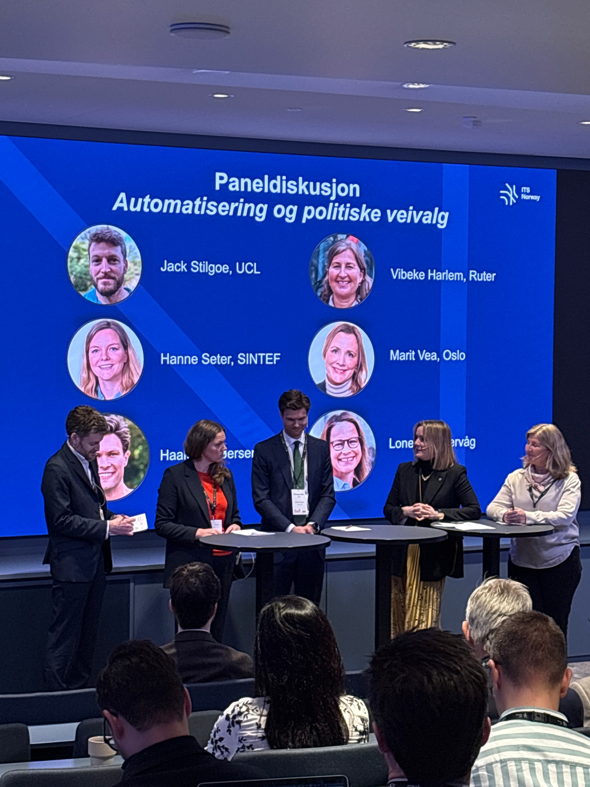
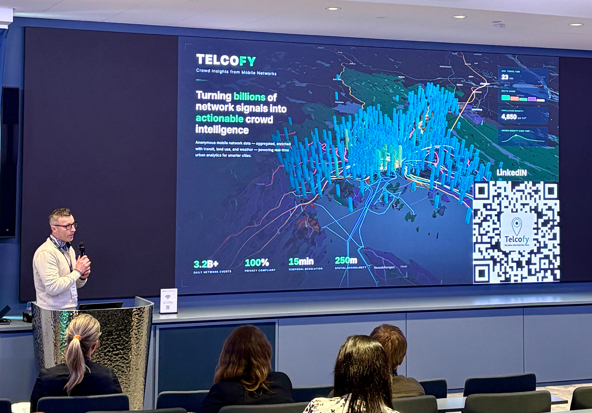

ITS Norway Day 2026 focused on a timely theme: **technology and trust in interaction**. Across the day, one message stood out clearly: new mobility solutions do not succeed on technology alone. They depend on alignment between policy, industry and society.

<!-- truncate -->

That tension came through in several strong contributions. Jack Stilgoe's perspective on the difference between **acceptance, trust and trustworthy** was especially relevant. Public authorities need to build trust. Industry needs to be trustworthy. That feels highly relevant in a sector now shaped by automation, AI, data sharing and increasing pressure on resilience.

The same applies to innovation. Many pilots are being launched, but not all of them are really pilots.

If success criteria are unclear, if there is no shared view of what happens after a good result, and if there is no realistic path into procurement, rollout or long-term operation, then it may be more accurate to call it a **test**.

That is not necessarily negative. Testing has value. But for startups and smaller companies, the difference matters. Too often, smaller players are asked to invest time, competence and innovation capacity into something that may never move beyond a limited exercise. A real pilot should not guarantee a delivery contract, but it should at least point toward a credible next step.

The panel on automation and political choices added an important practical dimension. With participants from UCL, Ruter, Vy, the City of Oslo and SINTEF, the discussion highlighted how difficult it still is to connect public needs, operational realities and regulatory readiness when automation is being introduced.

This was also reflected in the broader programme, from Jon-Ivar Nygard's opening on innovation, progress and vulnerability, to the panel on automation and political choices, and later sessions on Arctic testing, transport preparedness, AI and security, foresight, and robustness. Together, they highlighted how trust in transport is no longer only about vehicles or infrastructure, but also about governance, information sharing and the ability to act across sectors.

## Where can Telcofy contribute?

We believe better mobility insight can help make more pilots real pilots. By providing anonymised, aggregated decision support on how people actually move, public and private stakeholders can define stronger needs, clearer success criteria and better next steps. In short: better evidence makes it easier to move from testing to implementation.

It was also great to see the breadth of contributors throughout the day, including Jack Stilgoe, Jon-Ivar Nygard, Vibeke Harlem, Haakon Gloersen, Marit Vea, Hanne Seter, Ann Kristin Bjerknes, Gjermund Torp, Arild Tjomsland, Cato Holter, Kristine Dahl Steidel, Oystein Berge and Birger Steen. Tom Henriksen also presented Telcofy during the new member session, which made the day especially relevant for us.

Thank you to ITS Norway for a strong and relevant day. We left with a simple reflection:

**The transport sector does not need fewer tests. It needs more true pilots.**
