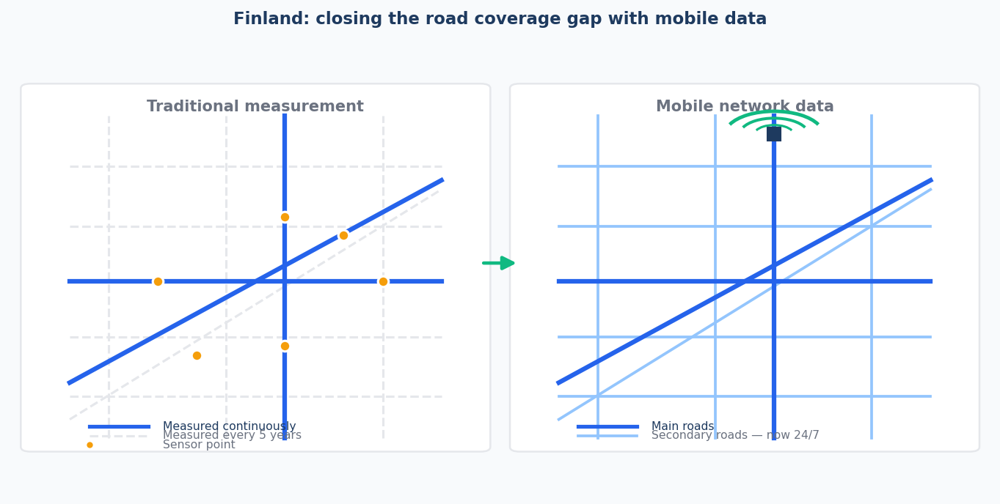
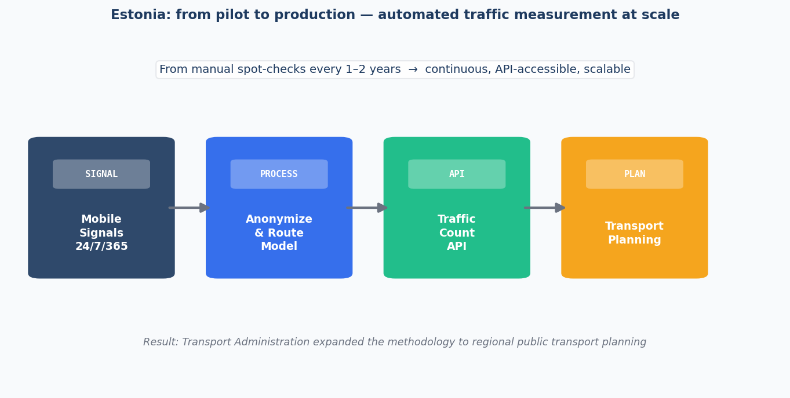
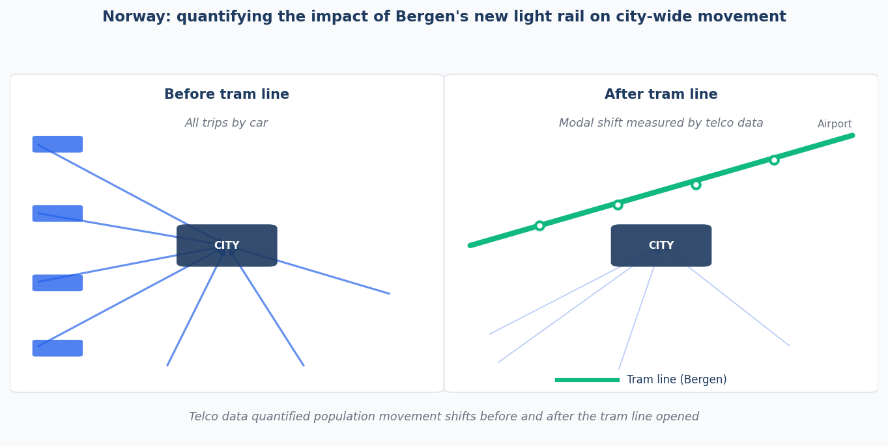
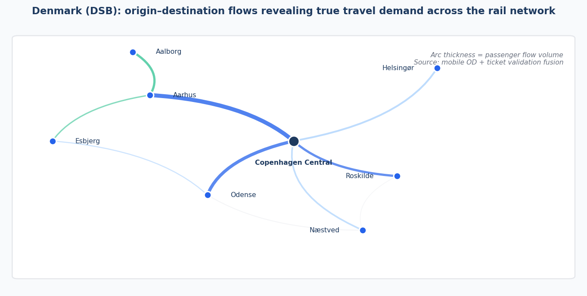
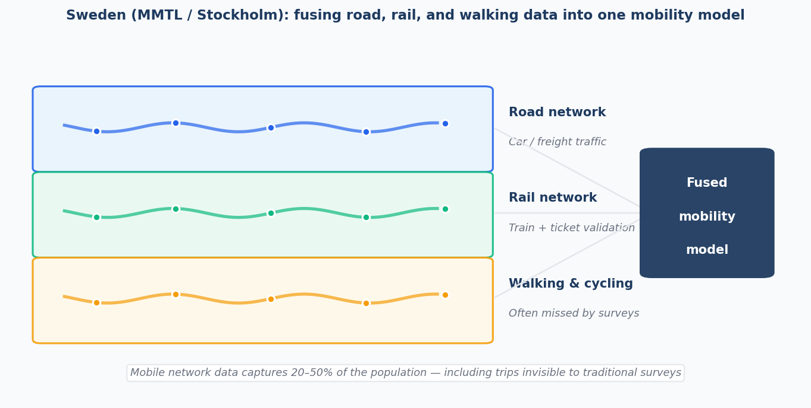

Most roads are never measured. Not because it is technically impossible, but because the traditional way of counting traffic — pneumatic tubes, sensor loops, fieldwork teams — simply cannot reach everywhere at a price anyone is willing to pay.

Across the Nordic countries and the Baltics, we have spent the last several years working with national transport authorities on a different approach: using anonymized mobile network data to measure traffic continuously, automatically, and at scale. Here is what we learned.

<!-- truncate -->

## The coverage problem

In both Finland and Estonia, the situation is similar. Automated traffic measurement points cover the main highways. Everything else — the secondary roads that connect towns, carry freight, and shape how rural regions actually function — gets measured manually, by specialists with pneumatic tubes, on a rotating cycle that takes **five years to complete one full pass**.

A lot can change in five years. A new logistics hub opens. A border crossing gets busier. A bypass road shifts traffic patterns overnight. By the time the measurement catches up, the data is already history.

When Fintraffic set out to address this, the goal was modest: validate whether telco data could fill the gaps. The answer, after a year-long pilot covering continuous 24/7 data collection, anonymization, routing and road-segment modeling, was yes. Fully automated. No field crews. No rotating schedules. Coverage that scales to every road in the country.

[Press release](https://futuremobilityfinland.fi/article/telia-crowd-insights-enhances-finnish-road-traffic-management-for-fintraffic/)

## From pilot to production: Estonia

Estonia ran a similar validation and reached a similar conclusion. After the pilot proved that telco-based measurement could make secondary road data regular, automated, and API-accessible, the Transport Administration identified regional public transport planning as a natural next domain to explore.

The potential is significant. When data becomes continuous and API-accessible, it stops being a periodic report and becomes an operational resource. Planners can react to what is actually happening, not to what was happening during a measurement window three years ago.

[Press release](https://www.transpordiamet.ee/uudised/transpordiamet-katsetab-liikluse-analuusimist-mobiilsete-liikuvusandmete-abil)

## Norway: beyond counting

In Norway, the use cases moved beyond measurement into impact analysis and operations.

When Bergen opened a new light rail line connecting the city centre to the airport, mobility data made it possible to quantify what actually changed — not just how many people rode the tram, but how the arrival of the line reshaped movement patterns across the wider city. Before-and-after analysis at that scale is not something traditional sensors can deliver; they only count what passes in front of them.

The work with Statens Vegvesen (Norwegian Public Roads Administration) went further still. One strand was research with SINTEF into a new road toll concept based on telco data. Another explored how mobile network activity could inform decisions about mountain pass closures during extreme weather — including the idea of dispatching direct notifications to devices in the vicinity of an affected pass. These were research and feasibility exercises, not production systems, but they pointed toward a direction: traffic data as a real-time safety tool, not just a planning input.

## Railways and origin-destination: Denmark

Danish National Railways (DSB) had a different challenge. Timetable optimization requires understanding where people actually travel between — not just which stations they use, but the full origin-to-destination patterns connecting railway stations to the towns and villages around them. Conventional ticketing data tells you where someone boarded and alighted. It does not tell you where they started or where they ended up.

Anonymized mobility data, combined with ticket validation records, fills that gap. The result is an origin-destination matrix that reflects genuine travel demand, giving planners a factual basis for deciding which routes and frequencies are genuinely needed.

## Multimodal management: Sweden

The most research-intensive application we contributed to was the Multimodal Traffic Management (MMTL) project, a collaboration between Linköping University, KTH Royal Institute of Technology, and Trafikverket. The project fused mobile network data with smart card validations to estimate mode shares across road and public transport networks simultaneously.

One outcome: using unsupervised machine learning to cluster "typical days," the model achieved short-term link flow prediction with an error rate of **10–15%**, while also identifying travel anomalies driven by weather or major events. Another finding was that route choice models incorporating factors like route simplicity and dynamic travel times substantially outperform models that use travel time alone — a more realistic picture of how people actually decide to move.

The Stockholm public transport study, which we supported on the data processing and origin-destination modeling side, pointed toward a practical implication: mobile analytics can capture all-mode travel including walking and cycling segments that conventional surveys routinely miss, covering between 20% and 50% of the population in a privacy-preserving way.

[MMTL research paper](https://fudinfo.trafikverket.se/fudinfoexternwebb/Publikationer/Publikationer_007701_007800/Publikation_007779/MMTL_final%20report_report.pdf) · [Stockholm press release](https://www.teliacompany.com/en/news-articles/wsp-sees-increased-interest-in-telias-data-for-more-sustainable-cities)

## What connects these projects

Each of these projects started with the same underlying problem: the data that exists does not cover enough, is not continuous enough, or arrives too late to be useful. Traditional measurement methods were not designed for the scale or speed that modern transport planning requires.

Telco data does not replace sensors or surveys. But for the roads nobody counts, the routes nobody surveys, and the movements nobody currently sees, it offers something those methods cannot: coverage that scales with the network, not with the budget for field crews.

That is the foundation we built Telcofy on.
