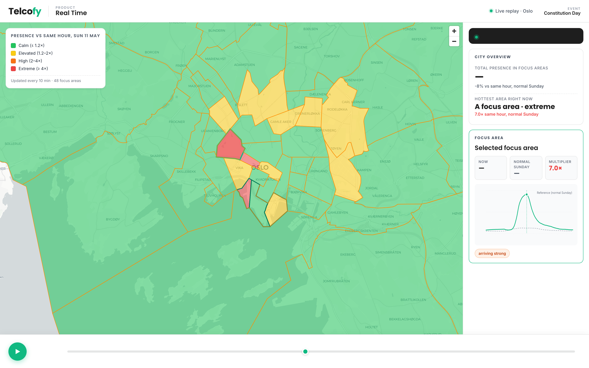
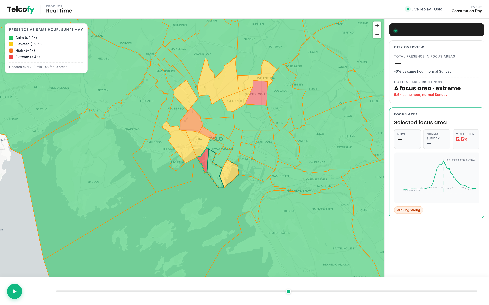
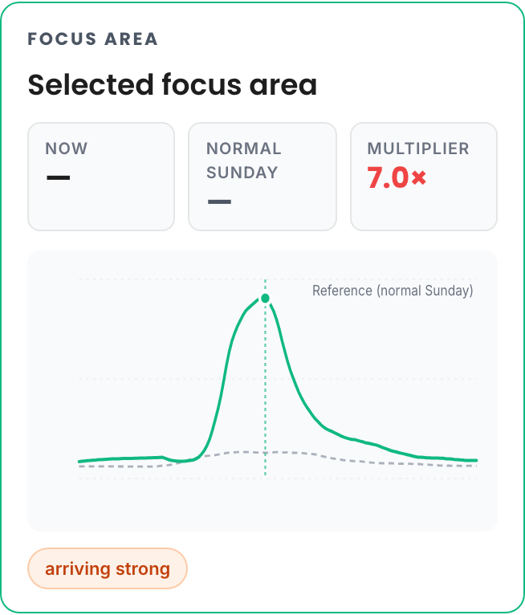

Every May 17, a wave of people moves through Oslo. Families gather along the parade route in the morning, the children's parade walks through the city centre through lunchtime, and the crowd drifts down to the waterfront for the rest of the afternoon. Everyone in Oslo knows this rhythm. We wanted to see if we could watch it happen, live, from the data.

*Parade peak. The focus areas along the route light up; the surrounding city stays close to its normal Sunday. The busiest area in this moment runs around seven times its usual presence at the same hour.*

<!-- truncate -->

This is what Telcofy does. We turn anonymised mobility signals into measurements of how cities actually move, in time and in space. No identities, no devices, no individuals. Just the shape of presence, refreshed every few minutes.

Constitution Day was the test. We split central Oslo into a set of focus areas along the parade route and across the surrounding city, characterised the normal weekend rhythm of each area, and then watched what happened on the day.

The wave was there. The parade-route polygons filled up first, well before the parade arrived. The focus area where the parade ends climbed steadily through the morning and peaked at the exact moment the parade walked through. The waterfront polygons caught the next hour, as the crowd dispersed toward the fjord. The waterside areas held a heightened presence late into the afternoon. Areas a few hundred metres off the route stayed quiet. The whole afternoon traced the path a person would have walked.

*The wave has moved. The parade-route polygons are dropping; the waterfront polygons along the fjord are peaking as the crowd disperses.*

Across the city as a whole, Oslo was noticeably busier than a normal Sunday. The extra presence wasn't just on the parade route; it was visitors arriving from outside, staying for the day, some staying the night. The pattern matched what you would expect, and it was visible in the measurements within minutes of it happening.

A few things made it work. Weeks of careful baselining so each area knows what normal looks like for it. Per-area noise characterisation so we don't cry "crowd" at every Tuesday lunch rush. A live pipeline that turns raw signal into a stable, defensible number on a tight cadence. None of it is dramatic on its own. Together they let us watch a city the size of Oslo find its rhythm, and then break it for one Sunday, and then come back to normal again.

*One focus area across the whole day. Solid green is Constitution Day; dashed grey is the same area one week earlier on a normal Sunday. The distance between the two lines is the event signal.*

Constitution Day had a known shape, which made it the right first test. Next we want to point the same approach at things with less predictable shapes: public events, transit disruptions, emergency response, the daily rhythm of a neighbourhood that no one has bothered to measure yet.

Cities have a pulse. We're learning to read it.
