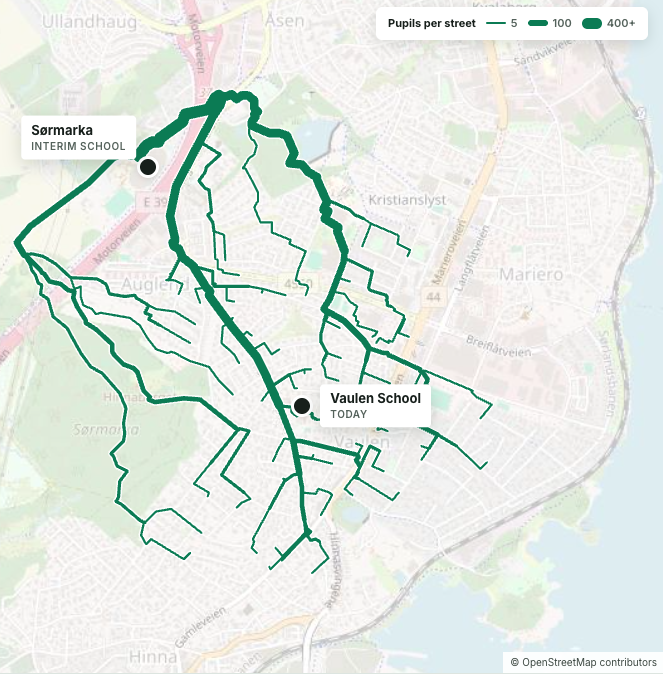
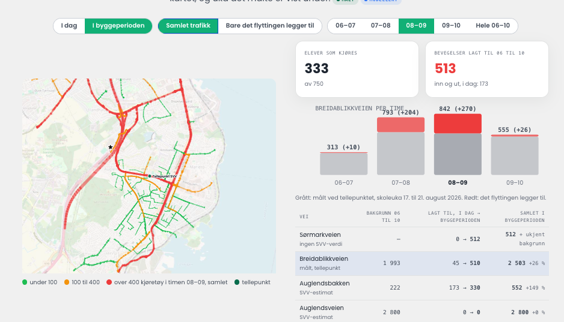

**Nedleggelser, sammenslåinger og midlertidige skoler endrer skoleveien for tusenvis av barn. Med Vaulen skole i Stavanger som case viser vi hvordan konsekvensene for barna og rushtrafikk kan måles før vedtaket fattes.**

*English version below: [jump to English](/blog/nar-skolen-flytter#english-version).*

<!-- truncate -->

En skole er mer enn et bygg. Den er et fast punkt i hverdagen til hundrevis av familier, og den bestemmer hvilke veier barna går, hvor foreldrene kjører og hvilke kryss som fylles opp klokka åtte hver morgen. Når skolen legges ned, slås sammen eller flytter til midlertidige lokaler i en byggeperiode, flytter alt dette med.

Likevel blir slike vedtak ofte fattet med godt underlag om bygg og økonomi, og mye tynnere underlag om hva som skjer på veien til skolen. Vi mener det kan gjøres bedre, og vi har testet det på en konkret sak: Vaulen skole i Stavanger.

## En nasjonal utfordring, ikke en lokal

Barnekullene blir mindre, og kommuneøkonomien er stram. Ifølge [Utdanningsdirektoratet](https://www.udir.no/tall-og-forskning/statistikk/statistikk-grunnskole/analyser/2026/skoler-lagt-ned-2025/) ble 46 grunnskoler lagt ned i 2025, og 623 er lagt ned siden 2010. Samlet er det 365 færre grunnskoler enn for 15 år siden. Nedgangen har vært størst i Finnmark, Innlandet og Nordland.

Presset fortsetter. [Utdanningsnytt](https://www.utdanningsnytt.no/arendal-skolenedleggelse-steinkjer/rundt-70-norske-skoler-sto-pa-kuttlistene-20-ble-reddet-av-politikerne/469386) fant at rundt 70 skoler sto på kommunenes kuttlister foran budsjettene for 2026, og at politikerne reddet rundt 20 av dem. Innen ti år ventes det om lag 50 000 færre barn og unge i Norge.

Samtidig står mange skoler foran rehabilitering eller nybygg. Da må elevene ofte flytte ut i flere år, til moduler, erstatningsskoler eller en annen skole. Det gjelder også i store kommuner som ellers ikke legger ned skoler. Bergen har for eksempel flere erstatningsskoler i bruk, og elevene som skal til [Ulriken erstatningsskole](https://www.bergen.kommune.no/hvaskjer/tema/vi-bygger-bergen/byggeprosjekter/skolebygg/byggeprosjekt-ulriken-erstatningsskole) kommer med buss.

En ny [forskningsrapport fra Telemarksforsking og Nordlandsforskning](https://www.utdanningsnytt.no/forskning-skolenedleggelse/ny-forskningsrapport-dette-er-konsekvensene-av-skolenedleggelser/484256) peker på lengre skolevei og overgangen til nye skolemiljøer som reelle belastninger for elevene. Rapporten peker også på at innsparingene i ettertid ofte er vanskelige å dokumentere.

Bare i [dette utvalget](#omfang) finner vi 16 kommuner og fylkeskommuner i 12 av landets 15 fylker. Mønsteret er det samme overalt. Et vedtak om skolestruktur endrer skoleveien til barna, og konsekvensene for trafikken blir sjelden tallfestet før vedtaket fattes.

## Caset: Vaulen skole flytter til Sørmarka

Vaulen skole i Stavanger er fra 1960. I januar 2026 vedtok formannskapet at den skal rives og erstattes av en ny skole på samme tomt. I byggeperioden skal elevene gå på en midlertidig modulskole ved Sørmarka Arena. Planen var å flytte høsten 2025, men flyttingen er utsatt to ganger, først på grunn av fukt- og råteskader og deretter fordi byggene ikke var ferdige. Byggestart for den nye skolen er tidligst 2029–30, så den midlertidige skolen kan bli brukt i flere år.

FAU tok tidlig opp spørsmål om skoleskyss, henting og levering, kapasiteten i droppsonene og trygge kryssinger. Nordic Edge ba oss om å se på hva flyttingen betyr for trafikken. Vi ruter hver skolevei på det faktiske gangnettet, både til dagens skole og til Sørmarka. Det gjør vi for 750 modellerte elever i de 1 329 boligene nærmest skolen. Resultatet er [publisert som et case](https://www.telcofy.ai/projects/vaulen-school):

- **Snittgangtiden blir mer enn tre ganger så lang.** Den går fra 9 til 31 minutter. I dag bor alle de modellerte elevene innenfor 15 minutters gange fra skolen. Til Sørmarka gjør ingen det.
- **442 elever får over 2 km skolevei.** 2 km er grensen for gratis skoleskyss på 1. trinn. Fra 2. trinn er grensen 4 km, og ingen av boligene ligger så langt unna. For de fleste elevene avgjør det derfor om skoleveien regnes som *særlig farlig eller vanskelig*. Da trengs det tall på hvor barna faktisk krysser veien.
- **386 elever krysser Sørmarkveien på samme sted.** Det er over halvparten av alle rutene. I dag krysser ingen av de modellerte rutene Sørmarkveien. Hvordan krysset er utformet, belyst og brøytet om vinteren, vil derfor påvirke flest barn.
- **Flere barn blir kjørt.** Modellen anslår at 333 av 750 elever blir kjørt til skolen. Det gir 513 bilbevegelser mellom kl. 06 og 10, mot 173 i dag. På Breidablikkveien øker trafikken i morgenrushet med 26 prosent, og på Auglendsbakken med 149 prosent.
- **Bussen hjelper lite.** Den nærmeste holdeplassen på den ene direkteruten ligger 139 meter fra skolen i luftlinje, men 866 meter unna til fots, fordi elevene må krysse E39.

Tallene er modellert, og det står tydelig hvor hvert tall kommer fra. Når kommunen legger inn den faktiske elevlisten, kjører vi den samme analysen på de ekte adressene. I tillegg måler vi tilstedeværelsen rundt begge skolene hvert tiende minutt, før og etter flyttingen. Da kan vi sjekke om trafikken faktisk endrer seg slik modellen forventer.

## Fra rapport til verktøy: prøv forutsetningene selv

Hvor langt det er greit at en sjuåring går, er et politisk valg. Det er ikke et fasitsvar. Derfor har vi laget analysen som et [interaktivt verktøy](https://vaulen.apps.telcofy.ai/#s=sormarka&t=15&m=walk&f=sormarka&c=sormarka&v=sum&h=08) (test - ta kontakt for fullversjon). Der kan politikere, saksbehandlere og FAU endre forutsetningene og se alle tallene regnes om med en gang.

I dag kan du velge hvor mange minutter det er akseptabelt å gå, velge mellom «bare gange» og «gange eller buss», og se biltrafikken time for time mellom kl. 06 og 10. Samme metode kan utvides med flere spørsmål som ofte kommer opp i slike saker:

- **Årstid.** Hva skjer med gangtid og andel som blir kjørt i mørke vintermåneder, eller når fortauene ikke er brøytet?
- **Kollektivtilbud.** Hvor mange flere kan ta bussen hvis en holdeplass flyttes, en rute legges om eller det kommer flere avganger i morgenrushet?
- **Hvor langt barna går.** Hvordan endrer resultatet seg hvis akseptabel gange er 10, 15, 20 eller 30 minutter? Og hvor mange barn havner da utenfor for hvert klassetrinn?
- **Trafikktiltak.** Hva betyr en hjertesone, en ny fotgjengerovergang eller at henting og levering flyttes til arenaen i stedet for Sørmarkveien?
- **Arrangementer.** Hva skjer med trafikken når det er arrangement i arenaen samtidig med skolestart eller skoleslutt?
- **Alternative lokasjoner.** Hvordan ser skoleveiene ut for ulike tomter eller midlertidige løsninger, sammenlignet side om side før vedtaket fattes?

## Hva dette gir beslutningstakere og foreldre

Vi tror slik innsikt bør være en fast del av alle saker om skolestruktur og midlertidige skoler, både før og etter vedtaket:

1. **Bedre beslutningsgrunnlag.** Politikerne kan sammenligne alternativer ut fra hvordan barna faktisk kommer seg til skolen, og ikke bare ut fra kvadratmeter og kroner.
2. **Tryggere skolevei.** Vi kan tallfeste hvor barna krysser veien og hvor mange som går hvor. Da vet kommunen hvor tiltakene gjør mest nytte, før skolen åpner.
3. **Riktig skoleskyss.** Kommunen kan se hvem som bor over avstandsgrensene, og hvor det er grunn til å vurdere om skoleveien er særlig farlig eller vanskelig.
4. **Bedre flyt i morgenrushet.** Når flere blir kjørt, endrer trafikken seg på veier som ikke var bygget for det. Med tallene i hånd kan kommunen planlegge hente- og bringesoner, gangveier og kollektivtilbud.
5. **Målt effekt.** Siden vi måler før og etter flyttingen, kan kommunen se om tiltakene virket.

## Står en skole i ditt område foran endringer?

Vi kan rute alle elevers skolevei til hver aktuelle lokasjon, telle kryssinger av trafikkerte veier og finne hvem som bor utenfor grensene for gratis skyss. Det kan vi gjøre med åpne data eller med skolens egen adresseliste. Dette gjelder for nedleggelser, sammenslåinger, nye skolekretser og midlertidige skoler.

Er du saksbehandler, politiker eller FAU-leder? [**Ta kontakt med oss**](https://www.telcofy.ai/) – så viser vi hvordan det ser ut for din skole.

**Les hele caset:** [Hvor langt Vaulen-elevene må gå til Sørmarka](https://www.telcofy.ai/projects/vaulen-school)

**Prøv verktøyet:** [Vaulen skole – interaktiv trafikkanalyse](https://vaulen.apps.telcofy.ai/#s=sormarka&t=15&m=walk&f=sormarka&c=sormarka&v=sum&h=08) (test - ta kontakt for fullversjon)

### Omfang: et utvalg kommuner og fylkeskommuner {#omfang}

**Skrivebordsundersøkelse, per september 2026.** Tabellen er satt sammen fra offentlige kilder (kommunenes nettsider og nyhetsartikler). Den er ikke komplett, og den kan inneholde feil eller mangle senere vedtak og informasjon som ennå ikke er publisert. Sjekk alltid med kommunen eller fylkeskommunen før du bruker tallene videre.

Vis tabellen: 16 kommuner og fylkeskommuner i 12 av 15 fylker

| Fylke | Kommune / fylkeskommune | Endring i skoletilbudet | Status |
|---|---|---|---|
| Rogaland | Stavanger | Vaulen skole flytter til midlertidig modulskole på Sørmarka mens ny skole bygges | Vedtatt jan. 2026. Flyttingen er utsatt to ganger, og ny dato er ikke satt |
| Agder | Arendal | Fire skoler foreslått nedlagt (Eydehavn, Nesheim, Strømmen, Moltemyr) | Vedtatt mars 2026, men Strømmen ble tatt ut |
| Oslo | Oslo | Skolebehovsplan 2026–2045: flere skoler endrer trinn og skolekrets | Vedtatt des. 2025 |
| Vestfold | Larvik | Forslag om å legge ned åtte skoler, slik at det blir igjen ti barneskoler og tre ungdomsskoler | Utsatt i des. 2025. Utfallet i 2026 er ikke bekreftet |
| Nordland | Bodø | Kjerringøy eller Skaug skole kan bli lagt ned | Bystyret behandler saken 29. okt. 2026 |
| Innlandet | Elverum | Har 8 skoler med plass til 2 155 elever, men 1 586 elever. Strukturen utredes | Under utredning |
| Akershus | Eidsvoll | Barnehage- og skolestrukturen utredes | Under utredning |
| Agder | Lillesand | Utredning av «fremtidig bærekraftig skolestruktur» | Under utredning |
| Rogaland | Eigersund | Skolebruksplan 2026–2036 | Under behandling |
| Østfold | Halden | Nedleggelse av barneskoler har vært utredet | Vedtaket er utsatt |
| Trøndelag | Steinkjer | Fem skoler foreslått nedlagt | Alle fem beholdt i budsjettet for 2026 |
| Buskerud | Drammen | Ingen nedleggelser, men nye skolekretser for seks skoler | Vedtatt des. 2025, gjelder fra 2026/27 |
| Vestland | Bergen | Sju skoler foreslått nedlagt, og flere erstatningsskoler er i bruk | Nedleggelsene ble stanset juni 2025 |
| Troms | Tromsø | Forslag om å legge ned flere skoler | Stanset mars 2025 |
| Innlandet | Innlandet fylkeskommune | Seks videregående skoler og skolesteder nedlagt (ca. 730 elevplasser) | Vedtatt okt. 2024 |
| Østfold | Østfold fylkeskommune | Borg og Greåker videregående skole nedlagt | Vedtatt des. 2024 |

Kilder: Utdanningsdirektoratet (2026), Utdanningsnytt (des. 2025 og mars 2026), Telemarksforsking/Nordlandsforskning (2026), Stavanger kommune, samt nettsidene til kommunene og fylkeskommunene i tabellen. Takk til Nordic Edge for bestillingen og bakgrunnen for caset.

## English version

*When the school moves, the morning rush moves with it and affects the “safe” school commute.*

A school is more than a building. It is a fixed point in the daily lives of hundreds of families. It decides which routes children walk, where parents drive and which junctions fill up at eight every morning. When a school closes, merges or moves to temporary premises during construction, all of that moves with it.

Yet these decisions are often made with solid information on buildings and budgets, and much thinner information on what happens on the way to school. We think that can be done better, and we tested it on a real case: Vaulen School in Stavanger.

### A national challenge, not a local one

Birth cohorts are shrinking and municipal budgets are tight. According to the [Norwegian Directorate for Education and Training](https://www.udir.no/tall-og-forskning/statistikk/statistikk-grunnskole/analyser/2026/skoler-lagt-ned-2025/), 46 primary and lower secondary schools closed in 2025, and 623 have closed since 2010. In total there are 365 fewer schools than 15 years ago, with the steepest decline in Finnmark, Innlandet and Nordland. Ahead of the 2026 budgets, around 70 schools were on municipal cut lists, and politicians saved about 20 of them. Many other schools face renovation or rebuilding, which sends pupils to modular buildings or replacement schools for years.

In our desk review (as of September 2026), we found 16 municipalities and county councils in 12 of Norway's 15 counties that have decided on, or are considering, changes to their school structure. They include Stavanger, Arendal, Oslo, Larvik, Bodø, Bergen and the county councils of Innlandet and Østfold. The [Norwegian table above](#omfang) lists them. It is based on public sources and may contain errors or miss later decisions and unpublished information.

### The case: Vaulen School moves to Sørmarka

Vaulen School dates from 1960. In January 2026, the city decided to demolish it and build a new school on the same site. During construction, pupils will attend a temporary modular school next to Sørmarka Arena. The move has been postponed twice, and construction of the new school cannot start before 2029–30. We routed every walk to school on the actual footpath network, both to today's school and to Sørmarka, for 750 modelled pupils in the 1,329 homes nearest the school:

- **The average walk more than triples**, from 9 to 31 minutes. Today every modelled pupil lives within a 15-minute walk of the school. None would be within 15 minutes of Sørmarka.
- **442 pupils would live more than 2 km away.** That is the limit for free school transport in first grade. From second grade the limit is 4 km, and no home is that far away. For most pupils, eligibility therefore depends on whether the route counts as *particularly dangerous or difficult*.
- **386 pupils would cross Sørmarkveien at the same point**, more than half of all routes. Today no route crosses that road.
- **More children would be driven.** The model estimates that 333 of 750 pupils would be driven, adding 513 car movements between 06:00 and 10:00, compared with 173 today. That is 26% more morning traffic on Breidablikkveien and 149% more on Auglendsbakken.
- **The bus helps little.** The nearest stop on the one direct route is 139 m from the school as the crow flies, but 866 m on foot, across the E39 motorway.

### From report to tool

How far a seven-year-old should walk is a political choice, not a fixed answer. That is why we built the analysis as an [interactive tool](https://vaulen.apps.telcofy.ai/#s=sormarka&t=15&m=walk&f=sormarka&c=sormarka&v=sum&h=08) (Test in Norwegian - reach out for full version). Politicians, planners and parent councils can change the assumptions and see every number recalculated at once. The same method can be extended to cover seasons (dark winter mornings, snow on the pavements), changes to public transport, how far children are expected to walk by grade, traffic measures such as school safety zones and new crossings, events at the arena, and side-by-side comparisons of alternative sites before a decision is made.

### What this gives decision-makers and parents

It gives them better evidence for the decision, safer routes to school, the right people getting school transport, smoother traffic in the morning rush, and a way to measure the effect afterwards. We measure presence around both schools every ten minutes, before and after the move, so the model can be checked against reality.

**Is a school in your area moving, merging or changing its catchment?** We can route every pupil's walk, count the road crossings and find who lives beyond the free-transport limits, using open data or the school's own address list. [**Talk to us**](https://www.telcofy.ai/).

**Read the full case study:** [How far Vaulen pupils would walk to Sørmarka](https://www.telcofy.ai/projects/vaulen-school)
