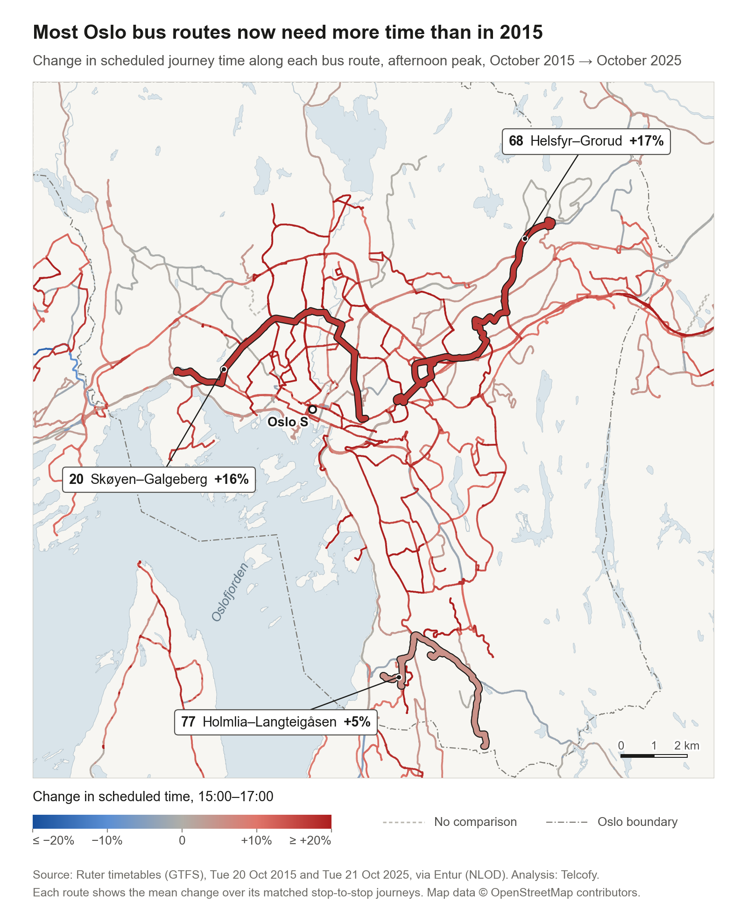
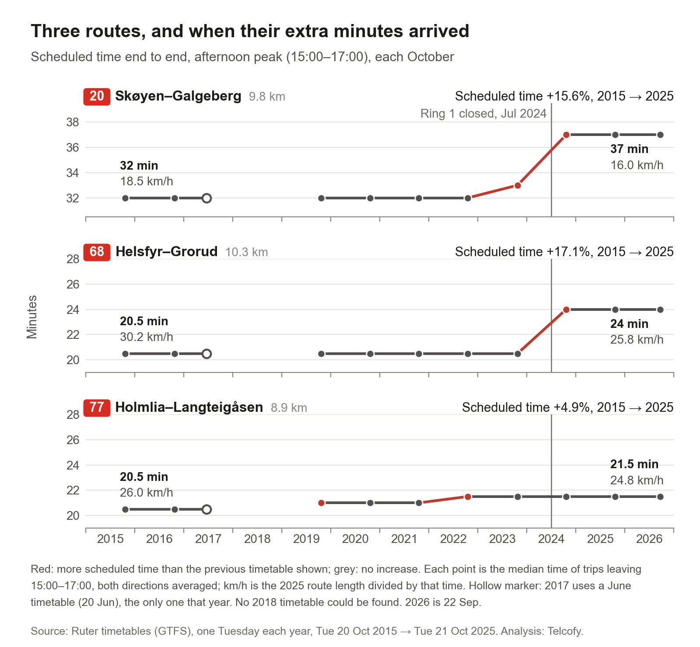
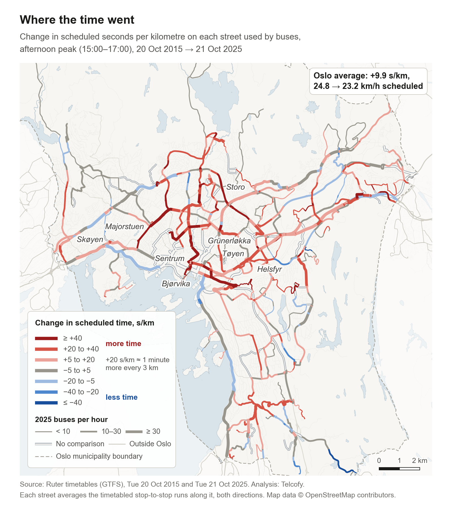
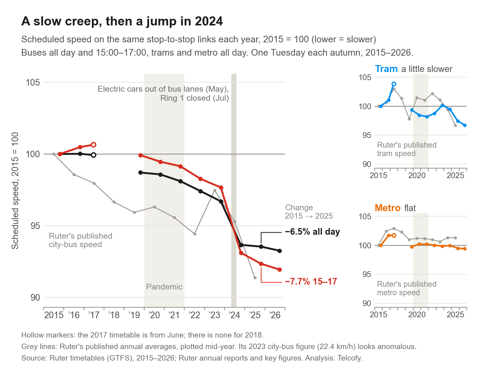
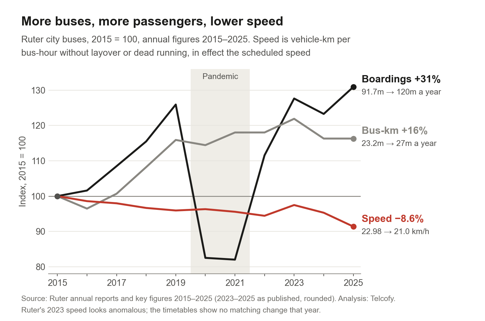
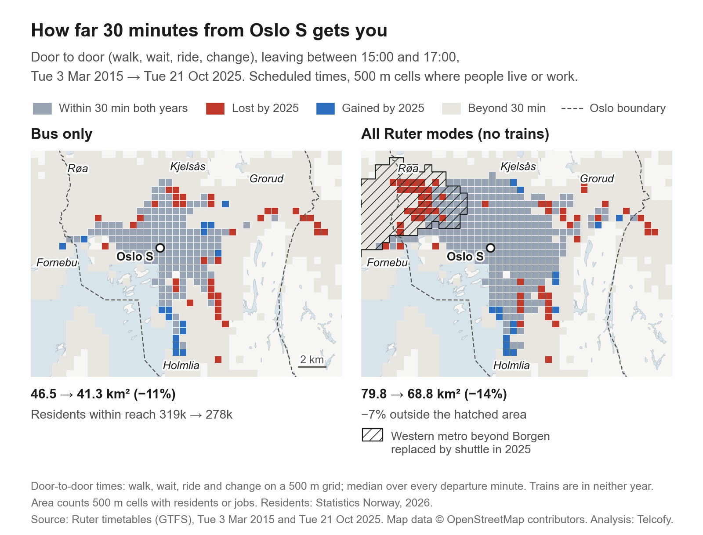
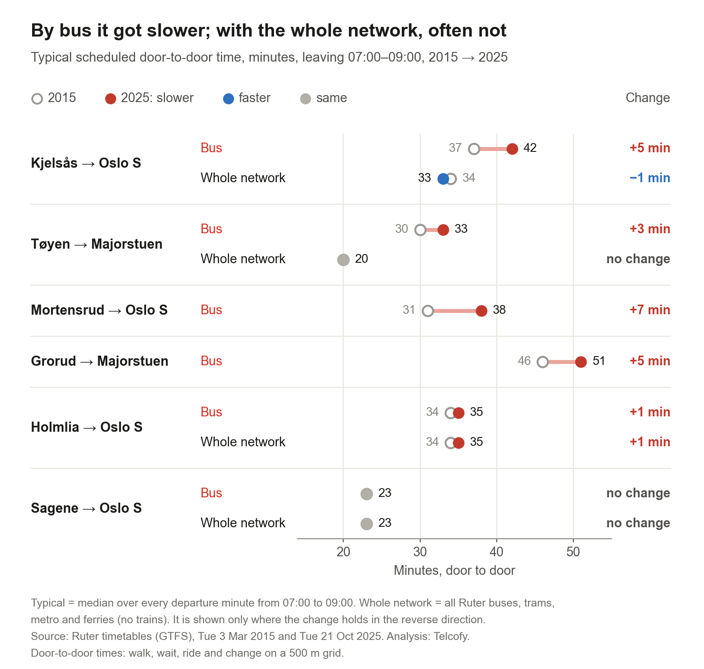
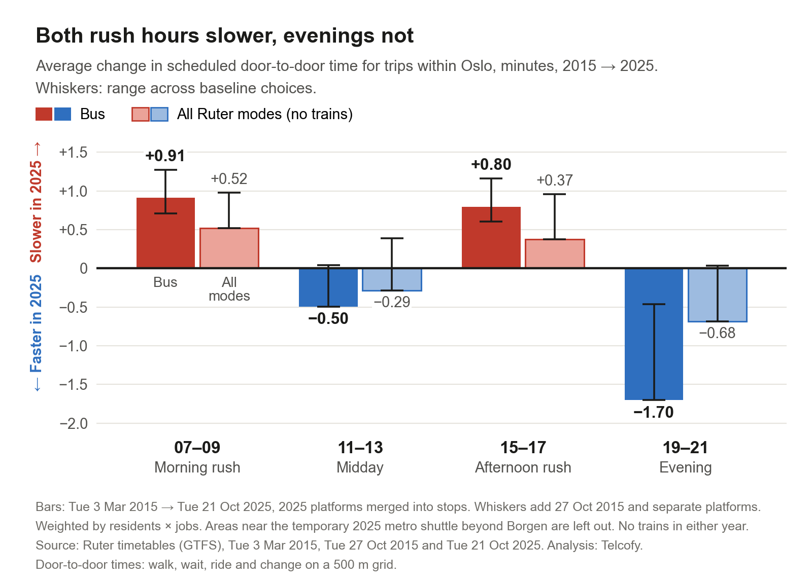
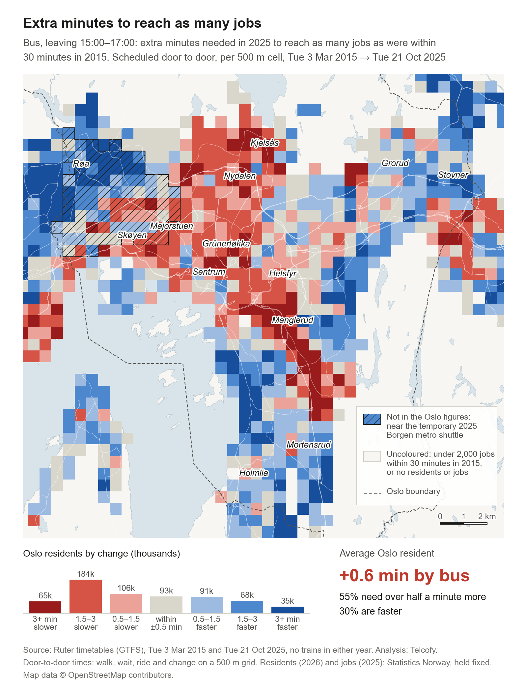
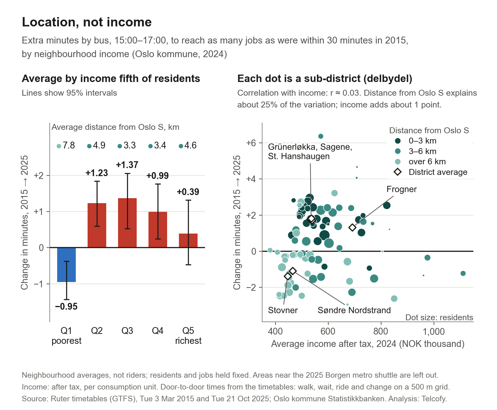

On 23 September the Guardian published [a visual investigation of London's buses](https://www.theguardian.com/uk-news/ng-interactive/2026/sep/23/london-buses-in-terminal-decline-why-public-transport-in-global-cities-is-slowing-to-a-crawl-visualised). It found them slowing down and losing passengers. We asked the same question of Oslo, using ten years of Ruter's timetables, and then followed the trip door to door across the whole network.

The short answer: Oslo's timetables now give buses about 7 to 8% more time between the same stops than in 2015. Unlike London's, Oslo's buses are not losing passengers. Ruter's city buses carried 31% more boardings in 2025 than in 2015. And door to door, trams and the metro soften the loss.

In this post, "slower" means the timetable allows more time for the same trip. We did not measure buses on the street. Ruter's own measurements come near the end.

*Each 2025 bus route, coloured by how much more (red) or less (blue) time the afternoon timetable allows between the same stops than in October 2015. Colours pool every bus between matched stops, so more routes are coloured here than the 39 we count below.*

<!-- truncate -->

## Slower on every timetable measure

Ruter's own figure for city-bus speed, kilometres driven divided by hours in service, fell from 22.98 km/h in 2015 to 21.0 km/h in 2025, down 8.6% ([Ruter key figures](https://ruter.no/rapporter/aarsrapport2025/okonomi-2025/ruters-okonomi-og-nokkeltall-2025)). It is in effect a timetable measure: our rebuild from the timetables matches it within 0.4 km/h in every year but 2023.

Our own measure holds the stops fixed. Between the same pairs of neighbouring stops in Oslo, buses now get about 7% more time than in 2015 across the day, and 8% more in the afternoon peak, 15:00 to 17:00.

Trams, which share the streets with buses, slowed a little: Ruter's figure fell from 18.3 to 17.7 km/h. The metro, on its own tracks, did not, going from 30.2 to 30.6 km/h.

Using measured speeds, the Guardian found that 578 of London's 700 routes in continuous service were slower in 2025 than in 2015, and that the network average fell from 9.6 mph in 2013 to 9.18 mph in 2025/26. Our Oslo figures are timetabled, so compare the direction, not the size. Of the 39 Oslo bus routes with enough matched stops to compare cleanly, 32 got more time in the afternoon peak, 3 got less and 4 did not change. Across the whole day, 27 of 32 got more time.

## Three routes

The Guardian followed three London routes. It reports that the 22 is now 16% slower, the 207 14% and the 243 5%. We picked three Oslo routes that have kept the same path and end points for ten years, with changes over much the same range.

*There is no 2018 timetable, and the 2017 point is from June.*

Route 20 runs 9.8 km from Skøyen to Galgeberg and is one of Ruter's busiest bus lines, with about 10.4 million boardings a year ([Ruter line figures](https://aarsrapport2024.ruter.no/wp-content/uploads/2025/03/10-mest-populaere-linjer-per-driftsart-2024.xlsx)). In the afternoon peak its timetable allowed 32 minutes end to end every year from 2015 to 2022, 33 in 2023 and 37 from 2024. That is 16% more time, and scheduled speed down from 18.5 to 16.0 km/h.

Route 68, from Helsfyr to Grorud, went from 20.5 to 24 minutes, 17% more (30.2 to 25.8 km/h). Route 77, from Holmlia to Langteigåsen, went from 20.5 to 21.5 minutes, 5% more (26.0 to 24.8 km/h).

## Where the time went

We also worked out scheduled pace, in seconds per kilometre, on most Oslo streets used by buses.

*Thicker lines carry more buses.*

In the afternoon peak, buses are now given about 10 seconds more for every kilometre than in 2015, or about a minute more every 6 km. Scheduled speed on these streets fell from 24.8 to 23.2 km/h. Other times of day saw 8 to 9 seconds more. The darkest red is in and around the inner city: between Majorstuen and Storo, just east of Bjørvika, and from Tøyen towards Helsfyr. Some main roads further out held their times, and a few got faster.

## When: a slow creep, then 2024

On the same stop-to-stop links, the time allowed crept up about 3.4% between 2015 and 2023, or about 0.4% a year. Then, between December 2023 and October 2024, it jumped another 3% across the day and 5% in the afternoon peak.

*The thin grey line is Ruter's published city-bus speed; its 2023 value looks out of line with the other years. The small panels show trams and metro on the same scale.*

A lot changed in 2024. Electric cars were moved out of the city's bus lanes as new signs went up between 6 May and 1 June, which should have helped buses ([Oslo kommune](https://www.oslo.kommune.no/slik-bygger-vi-oslo/midlertidig-stenging-av-ring-1/forbud-mot-elbil-i-kollektivfelt/)). Ring 1 closed to traffic between Oslo Spektrum and St. Olavs gate from 1 July. Ruter changed its timetable in August, weeks after Ring 1 closed. The jump is biggest 1.5 to 3 km from Oslo S and smallest beyond 6 km, which fits the Ring 1 closure but does not prove it. The timetables cannot tell us whether Ruter added the time because of Ring 1, because of delays it had measured, or to run more punctually.

Punctuality did improve that year: 71.1% of bus departures left between 15 seconds early and 3 minutes late in 2024, up from 67.8% in 2023 ([Ruter](https://aarsrapport2024.ruter.no/baerekraft/sosiale-forhold/ruter-er-en-del-av-folks-hverdag/)).

## Busier, not declining

The Guardian reports that London's bus-km fell from 487 million to 460 million, and that ridership fell to 1.8 billion journeys in 2024. Oslo went the other way.

*Each line is set to 100 in 2015. Boardings dip in the pandemic years, then climb well past where they started.*

Ruter's city buses carried 120 million boardings in 2025, 31% more than the 91.7 million in 2015, and drove 16% more kilometres.

In Oslo, then, a slower timetable sits alongside growth, not decline. It still has a price. Slower schedules need more bus-hours and more buses to run the same service. Applied to today's Oslo bus traffic, the extra seconds per kilometre add up to about 240 extra bus-hours every weekday, and about 23 extra buses on the road in the afternoon peak. So part of the 21% rise in weekday bus-hours inside Oslo since 2015, from 3,559 to 4,322, is the slowdown itself. At [Oslo Economics'](https://osloeconomics.no/wp-content/uploads/2024/05/Ruters-forvaltning-av-samfunnets-midler_endelig-rapport.pdf) unit costs for city buses, the extra time costs roughly NOK 27 to 50 million a year, on weekdays alone. This is our estimate, not Ruter's.

## From your door, across the whole network

A bus timetable is only part of a trip. You also walk to the stop, wait, perhaps change, and walk at the other end. So we divided Oslo and the surrounding area into 500 m squares. We routed trips between them on each year's timetable, door to door, and took the typical time over every departure minute in a two-hour window.

We compared Tuesday 3 March 2015 with Tuesday 21 October 2025. We used March because in October 2015 part of the metro was replaced by buses. Residents and jobs are held at today's numbers, so only the network changes. The network is Ruter's buses, trams, metro and ferries. Trains are not in the data.

*Red squares were within 30 minutes of Oslo S in 2015 but not in 2025; blue ones are new. The hatching marks areas near the western metro beyond Borgen, replaced by a temporary shuttle in 2025.*

Leaving Oslo S in the afternoon peak, the area you can reach by bus within 30 minutes shrank by 11%, and the number of residents within reach fell from 319,000 to 278,000. With all modes the area shrank by 14%, but much of that is the temporary metro closure. Outside the hatched area the loss is about 7%.

On single journeys, the bus lost minutes where the tram and metro held.

*Leaving between 07:00 and 09:00. A whole-network row appears only where the result holds in both directions.*

From Kjelsås to Oslo S in the morning, the timetable now gives 42 minutes door to door by bus, up from 37. Using the whole network, which here means the tram, it is 33 minutes instead of 34. Tøyen to Majorstuen is 3 minutes slower by bus but still 20 minutes by metro.

Across all trips within Oslo, counted by where people live and work, both rush hours got slower. By bus, trips take 0.9 minutes longer in the morning and 0.8 in the afternoon. With all modes it is 0.5 and 0.4. Longer trips lost more: in the morning, bus trips under 4 km got about half a minute slower, and trips over 12 km nearly 2 minutes slower.

That is much less than 7 to 8%, because the ride is only part of the trip and the walk to and from the stop takes as long as it always did. Midday and evening are flat or faster, depending on which 2015 day we compare with, because more frequent service at those times means shorter waits.

*The whiskers show how far the answer moves with the choice of 2015 day and the way stops are coded. The rush-hour losses hold in every case.*

The last map asks a different question. For each square, take the number of jobs you could reach by bus within 30 minutes in 2015. How many extra minutes do you now need to reach as many?

*Bus, leaving between 15:00 and 17:00. Red squares need more time than in 2015, blue squares less. The strip underneath counts residents in each class.*

Away from the areas around the metro closure, Oslo residents need 0.6 minutes more by bus on average. The spread is wide: 55% need more than half a minute extra, a quarter more than 2 minutes, and 30% are at least half a minute faster.

## Who loses

Does a slower bus hit poorer neighbourhoods hardest? We checked against Oslo kommune's 2024 income figures for 97 neighbourhoods, using the jobs measure from the map above, by bus in the afternoon peak.

*Left: each fifth of Oslo residents, grouped by neighbourhood income and labelled with its average distance from Oslo S. Right: each neighbourhood, sized by residents and coloured by distance from the centre.*

The poorest fifth of residents came out ahead, needing 0.95 minutes less on average. The three middle fifths lost most, 1.0 to 1.4 minutes, and the richest fifth lost 0.4. The pattern follows location: the poorest fifth live on average 7.8 km from Oslo S, the middle fifth 3.3 km. Income on its own explains almost nothing. Distance from the centre explains about a quarter of the differences.

Oslo's lowest-income neighbourhoods are mostly in the outer east and south, and those held level or gained. Stovner, Alna and Søndre Nordstrand got 1.1 to 1.4 minutes faster, and Grorud stayed level. The inner city lost, rich or poor: the inner east (Gamle Oslo, Grünerløkka and Sagene) about 1.7 minutes, and the better-off inner west (St. Hanshaugen and Frogner) about 1.5. In Oslo the dividing line is location, not income.

These are neighbourhood averages, not the people who actually ride. The areas near the metro closure are left out, which drops much of Ullern and Vestre Aker, the two districts with the highest average income.

## What timetables can't show

Ruter also measures what happens on the street. In the afternoon peak, its city buses took 31% longer than its ideal running time in 2022, and 34% longer in 2025 ([2022](https://aarsrapport2022.ruter.no/wp-content/uploads/2023/05/Helhetlig-planlegging-gir-et-bedre-kollektivtilbud-%E2%80%93-Ruters-arsrapport-2022.pdf), [2025](https://ruter.no/rapporter/aarsrapport2025/aaret-2025/utvikling-av-tilbudet-i-2025)). Across the whole day the figure rose from 20% to 22%. So measured delays grew over the same years, not just the time in the plan. With punctuality up in 2024, one reading is that the extra minutes in the timetable bought reliability.

We can test that. Entur's open archive of real-time data goes back to 2023, which makes a measured before-and-after for July 2024 possible. We plan to do that next. It is also the kind of comparison Telcofy is built for: setting measured movement, including anonymised mobile network data, next to the plan.

## How we did it

### Source data

- **Timetables:** Ruter's timetable for one ordinary Tuesday each autumn, 2015 to 2026, from the TransitFeeds archive and Entur. None survives for 2018, and 2017 is a June day. Routes and streets compare 20 October 2015 with 21 October 2025. Door to door uses 3 March 2015.
- **Ruter's annual reports and key figures,** 2015 to 2025.
- **Residents and jobs:** Statistics Norway 250 m grids (residents 2026, jobs 2025).
- **Income:** Oslo kommune, after-tax income per consumption unit by neighbourhood (delbydel), 2024.
- **Streets and footpaths:** OpenStreetMap.

### Method

- **Same stops.** Stops are matched between years by name and position, and replacement buses are left out. A route counts as compared cleanly when at least 10 matched stop-to-stop journeys are served by the same route number in both years.
- **Streets.** Timetables round to the whole minute, so the street map compares pace over stretches of a few kilometres between matched stops. The very centre has gaps where today's buses use streets or stops that 2015 buses did not.
- **Door to door.** Walking all the way counts if it is quicker. Averages weight trips by residents at the start and jobs at the end. 2025 platforms are merged into single stops, as in 2015. "Near the metro closure" means within 1.5 km of stations served only by the 2025 shuttle beyond Borgen.
- **Costs.** We applied the extra seconds per kilometre to the 2025 Oslo bus timetable and priced them at Oslo Economics' marginal unit costs: NOK 721 per route-hour and NOK 343,000 per bus a year, in 2021 prices. The low end counts only the four time windows we measured, and the high end counts the whole day plus the extra buses. Weekdays only, with no recovery margin and no contract prices.

---

*Inspired by the Guardian's [visual investigation of London's buses](https://www.theguardian.com/uk-news/ng-interactive/2026/sep/23/london-buses-in-terminal-decline-why-public-transport-in-global-cities-is-slowing-to-a-crawl-visualised). Timetables from Ruter via Entur and the TransitFeeds archive; contains data under the Norwegian licence for Open Government data (NLOD) distributed by Entur. Door-to-door routing with the open-source [R5](https://github.com/conveyal/r5) engine via [r5py](https://r5py.readthedocs.io/). Population and jobs from SSB (Statistics Norway). Income from Oslo kommune. Maps © OpenStreetMap contributors.*
